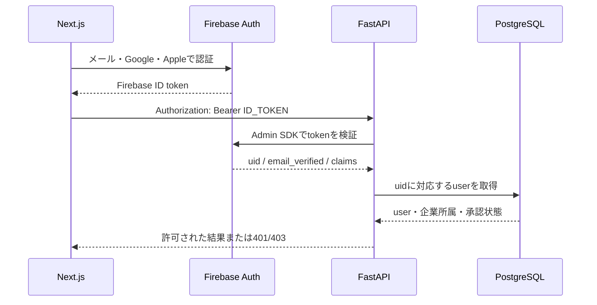
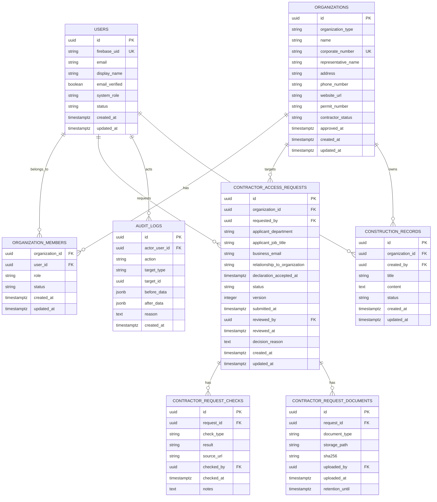
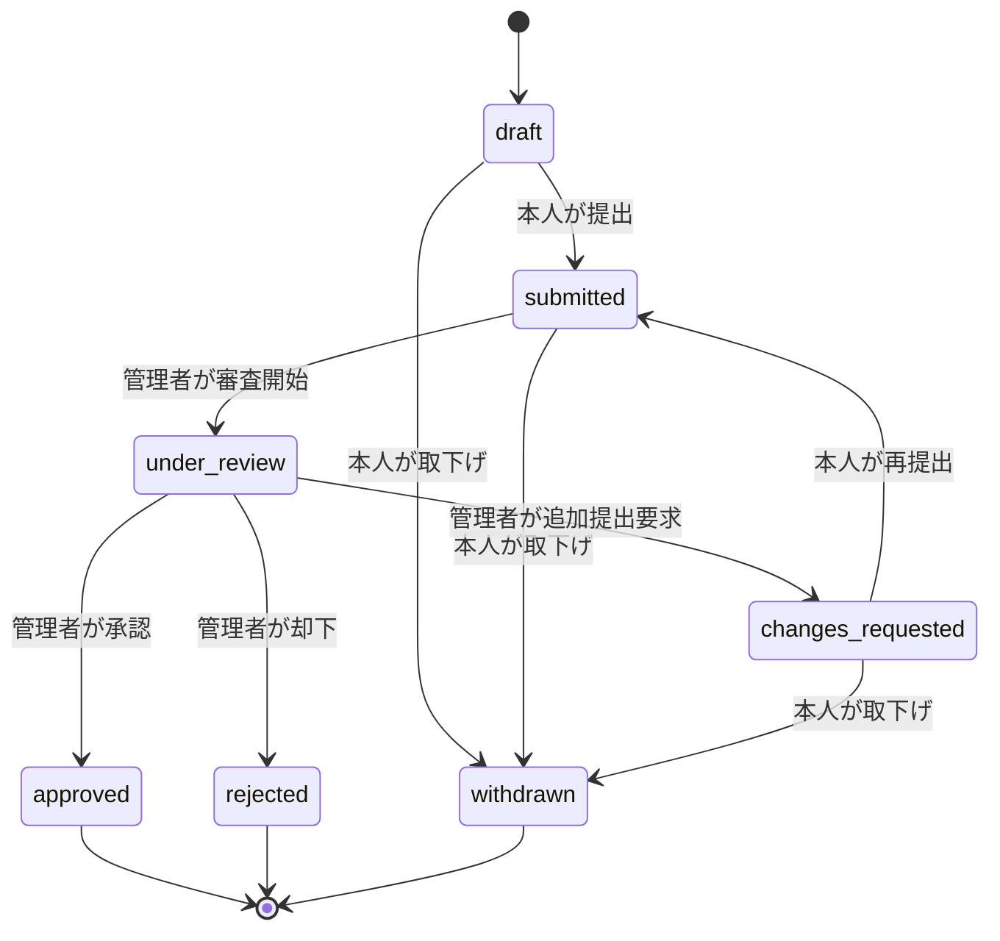
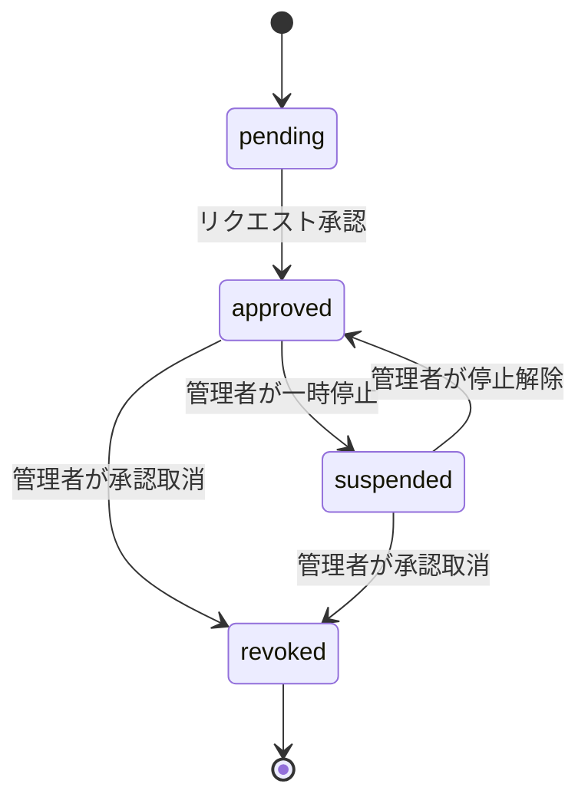

# リビングデザイン PoC バックエンド

見積もり支援PoCのバックエンドAPIです。FastAPIでAPIを提供し、将来的に
PostgreSQL + pgvectorを利用したRAG検索と見積もりロジックを実装します。

現在は、文書登録と文字列の部分一致検索をメモリ上で行う最小構成です。
PostgreSQLへの保存、Embedding生成、ベクトル検索はまだ接続していません。

## 必要な環境

- Python 3.10以上
- Docker
- Docker Compose v2（`docker compose` コマンド）
- curl

## ディレクトリ構成

```text
backend/
├── app/
│   ├── __init__.py
│   ├── main.py
│   └── api/
│       ├── __init__.py
│       └── rag.py
├── docker-compose.yml
├── pytest.ini
├── pyrightconfig.json
├── requirements-dev.txt
├── requirements.txt
├── tests/
│   ├── test_health.py
│   └── test_rag.py
└── README.md
```

## 環境構築

`backend` ディレクトリで仮想環境を作成し、依存パッケージをインストールします。

```bash
cd backend
python3 -m venv .venv
.venv/bin/python -m pip install --upgrade pip
.venv/bin/python -m pip install -r requirements.txt
```

仮想環境を有効化して作業する場合は、次を実行します。

```bash
source .venv/bin/activate
```

有効化後は、利用中のPythonを確認できます。

```bash
which python
python -c "import fastapi; print(fastapi.__version__)"
```

`which python` が `backend/.venv/bin/python` を指していれば正常です。

## ビルド相当の確認

現在はPythonパッケージやDockerイメージとして配布する構成ではないため、
専用のビルドコマンドはありません。依存関係とPythonコードを次のコマンドで確認します。

```bash
.venv/bin/python -m pip check
.venv/bin/python -m compileall -q app
.venv/bin/python -c "from app.main import app; print(app.title)"
```

期待される出力は次のとおりです。

```text
Living Design PoC Backend
```

## FastAPIの起動

開発時は、自動リロードを有効にして起動します。

```bash
.venv/bin/python -m uvicorn app.main:app --reload
```

外部ホストから接続する必要がある場合は、ホストを明示します。

```bash
.venv/bin/python -m uvicorn app.main:app \
  --host 0.0.0.0 \
  --port 8000
```

起動後は次のURLを利用できます。

- API: `http://127.0.0.1:8000`
- Swagger UI: `http://127.0.0.1:8000/docs`
- OpenAPI JSON: `http://127.0.0.1:8000/openapi.json`

## API

| Method | Path | 用途 |
| --- | --- | --- |
| GET | `/health` | APIの稼働確認 |
| POST | `/rag/documents` | 検索対象の文書をメモリへ登録 |
| POST | `/rag/query` | 登録済み文書を文字列の部分一致で検索 |

登録した文書はプロセスのメモリにだけ保存されます。サーバーを再起動すると消えます。

## curlによる動作確認

FastAPIを起動した状態で、別のターミナルから実行します。

### 1. ヘルスチェック

```bash
curl --fail --silent --show-error \
  http://127.0.0.1:8000/health
```

期待結果:

```json
{"status":"ok"}
```

### 2. 文書登録

```bash
curl --fail --silent --show-error \
  -X POST http://127.0.0.1:8000/rag/documents \
  -H "Content-Type: application/json" \
  -d '{
    "title": "キッチン改修",
    "content": "キッチン交換と内装工事を実施しました"
  }'
```

期待結果:

```json
{
  "title": "キッチン改修",
  "content": "キッチン交換と内装工事を実施しました",
  "id": 1
}
```

### 3. 文書検索

文書登録と同じサーバープロセスに対して実行します。

```bash
curl --fail --silent --show-error \
  -X POST http://127.0.0.1:8000/rag/query \
  -H "Content-Type: application/json" \
  -d '{"query":"キッチン"}'
```

期待結果:

```json
{
  "query": "キッチン",
  "results": [
    {
      "title": "キッチン改修",
      "content": "キッチン交換と内装工事を実施しました",
      "id": 1
    }
  ],
  "answer": "キッチン交換と内装工事を実施しました"
}
```

### 4. 該当なしの検索

```bash
curl --fail --silent --show-error \
  -X POST http://127.0.0.1:8000/rag/query \
  -H "Content-Type: application/json" \
  -d '{"query":"浴室"}'
```

`results` が空配列になり、`answer` に該当情報がないことが返れば正常です。

## 自動テスト

開発用依存関係をインストールして、pytestとRuffを実行します。

```bash
.venv/bin/python -m pip install -r requirements-dev.txt
```

```bash
.venv/bin/python -m pytest
.venv/bin/python -m ruff check .
```

現在は、ヘルスチェック、文書登録、検索一致、検索不一致をテストしています。

## PostgreSQL + pgvector

`docker-compose.yml` には、PostgreSQL 17とpgvectorを含むDBサービスを定義しています。
現在のFastAPIはまだDBへ接続していないため、APIのcurl確認だけならDBの起動は不要です。

### DBコンテナの起動

```bash
docker compose up -d db
docker compose ps
```

DBの準備完了を確認します。

```bash
docker compose exec db pg_isready -U postgres -d app
```

### ログの確認

```bash
docker compose logs -f db
```

ログ表示は `Ctrl+C` で終了できます。DBコンテナ自体は停止しません。

### PostgreSQLへの接続

```bash
docker compose exec db psql -U postgres -d app
```

psqlを終了する場合は `\q` を入力します。

### pgvector拡張の有効化

イメージにpgvectorは含まれていますが、利用するデータベースで拡張を有効化する必要があります。

```bash
docker compose exec db \
  psql -U postgres -d app \
  -c "CREATE EXTENSION IF NOT EXISTS vector;"
```

確認:

```bash
docker compose exec db \
  psql -U postgres -d app \
  -c "SELECT extname, extversion FROM pg_extension WHERE extname = 'vector';"
```

### DBコンテナの停止と再開

コンテナを残したまま停止します。

```bash
docker compose stop db
```

再開:

```bash
docker compose start db
```

### DBコンテナの削除

```bash
docker compose down
```

ボリュームも削除してDBデータを初期化する場合だけ、次を実行します。

```bash
docker compose down --volumes
```

`--volumes` を付けるとDBデータを復元できなくなるため注意してください。現在のCompose設定には
明示的な名前付きボリュームがないため、永続化が必要になる段階で追加します。

## トラブルシューティング

### `ModuleNotFoundError: No module named 'fastapi'`

実行に利用しているPythonと、FastAPIをインストールしたPythonが異なっています。
このリポジトリでは `.venv` のPythonを明示して実行してください。

```bash
.venv/bin/python -c "import fastapi; print(fastapi.__version__)"
.venv/bin/python -m uvicorn app.main:app --reload
```

### `Address already in use`

ポート8000が使用中です。別ポートで起動できます。

```bash
.venv/bin/python -m uvicorn app.main:app --reload --port 8001
```

### PostgreSQLのポートが使用中

ホスト側の5432番ポートが別のPostgreSQLで使用されています。使用状況を確認するか、
`docker-compose.yml` のポート割り当てを変更してください。

```yaml
ports:
  - "5433:5432"
```

## 現在の制約と次の実装候補

- 文書はメモリ保存のため、再起動すると消える
- 検索は文字列の部分一致で、意味検索ではない
- PostgreSQLとFastAPIは未接続
- pgvector用テーブルとマイグレーションは未作成
- Embedding生成とLLMによる回答生成は未実装
- DB接続とHTTPレベルの自動テストは未作成

次の段階では、文書とチャンクをPostgreSQLへ保存し、pgvectorによる類似度検索へ
置き換えます。

## 認証・業者権限設計（計画）

このセクションは、今後実装するアカウント認証・業者権限リクエスト機能のbackend設計です。
現時点では未実装であり、既存のRAG仮APIとは分けて段階的に追加します。

全体方針は親リポジトリの
[認証・業者承認システム設計方針](https://github.com/nao317/livingDesignPoC/blob/main/docs/authentication-and-contractor-approval-design.md)
を参照してください。

### backendの責務

- Firebase Admin SDKでFirebase IDトークンを検証する
- Firebase UIDとローカルユーザーを対応付ける
- ユーザー、企業、企業所属をPostgreSQLで管理する
- 業者権限リクエストと審査証跡を管理する
- システム管理者だけに承認・却下・停止・取消を許可する
- 承認済み企業の `owner` / `editor` だけに施工情報の更新を許可する
- 権限変更と管理操作を監査ログへ記録する
- frontendから送られたロールや企業IDを信用せず、DBの最新状態を確認する

Firebase Authenticationは本人認証を担当し、業務上の権限と審査状態の正本はPostgreSQLに
置きます。

### 認証・認可フロー



認証済みAPIは、共通のFastAPI依存関係を通します。

```python
async def get_current_identity() -> FirebaseIdentity:
    """Bearer tokenを検証してFirebaseの本人情報を返す。"""


async def get_current_user() -> User:
    """Firebase UIDに対応する有効なDBユーザーを返す。"""


async def require_system_admin() -> User:
    """最新のシステム管理者権限を確認する。"""


async def require_approved_contractor(
    organization_id: UUID,
) -> OrganizationMembership:
    """企業承認状態と企業内ロールを確認する。"""
```

### DBスキーマ設計

すべての利用者は `users` の一般ユーザーとして開始します。業者権限の承認時に別ユーザーを
作らず、企業を承認し、同じユーザーを企業の `owner` として有効化します。



#### `users`

| カラム | 制約・用途 |
| --- | --- |
| `firebase_uid` | NOT NULL、UNIQUE。ユーザー識別の正本 |
| `email` | 連絡用。Apple匿名メールを考慮し識別子には使わない |
| `email_verified` | Firebaseの値を同期 |
| `system_role` | `user` または `system_admin` |
| `status` | `active`、`suspended`、`deleted` |

公開APIから `system_admin` を設定できないようにします。管理者追加は管理用スクリプトまたは
保護された管理APIだけに限定します。

#### `organizations`

| カラム | 制約・用途 |
| --- | --- |
| `organization_type` | `corporation` または `sole_proprietor` |
| `corporate_number` | 法人の場合はUNIQUE。個人事業主はNULLを許可 |
| `representative_name` | 代表者名。審査対象として保持 |
| `address` / `phone_number` | 事業所の所在地と連絡先 |
| `website_url` | 公式サイト。存在しない場合はNULL |
| `permit_number` | 建設業許可番号。対象外の場合はNULL |
| `contractor_status` | `pending`、`approved`、`suspended`、`revoked` |
| `approved_at` | 承認トランザクションで設定 |

#### `organization_members`

`organization_id` と `user_id` の組み合わせを一意にします。

| カラム | 値 |
| --- | --- |
| `role` | `owner`、`editor`、`viewer` |
| `status` | `invited`、`active`、`disabled` |

企業が `approved` でも、メンバーが `active` でなければ業者向けAPIを利用できません。

#### `contractor_access_requests`

同じリクエストを上書きし続けず、`version` と関連証跡を残します。同一企業に対する処理中の
リクエストは原則1件に制限します。

| カラム | 制約・用途 |
| --- | --- |
| `requested_by` | リクエストした一般ユーザー |
| `applicant_department` / `applicant_job_title` | 申請者と企業の関係確認に利用 |
| `business_email` | 審査連絡用。ユーザー識別子には使わない |
| `relationship_to_organization` | 代表者、従業員、代理人等の自己申告 |
| `declaration_accepted_at` | 申告事項と個人情報取扱いへの同意日時 |
| `version` | 同時更新を検知する楽観ロック用の整数 |

| 状態 | 更新可能な主体 |
| --- | --- |
| `draft` | リクエストした一般ユーザー |
| `submitted` | 本人の取下げ、管理者の審査開始 |
| `under_review` | システム管理者 |
| `changes_requested` | 本人の追加提出、管理者の再審査 |
| `approved` | 終端状態 |
| `rejected` | 終端状態。再リクエスト方針は別途定義 |
| `withdrawn` | 本人が取下げた終端状態 |

#### 審査書類と監査ログ

審査書類のバイナリはPostgreSQLへ保存せず、非公開のCloud Storageへ保存します。DBには
保存先、ハッシュ、提出者、保存期限を保持します。

`audit_logs` は通常のCRUD APIから更新・削除できない追記専用データとして扱います。
Firebase IDトークン、パスワード、審査書類本文はログへ保存しません。

### 状態遷移



業者承認後の企業状態は別に管理します。



### 承認トランザクション

承認APIは、次の更新を1つのDBトランザクションで実行します。

1. 対象リクエストが `under_review` であることをロックして確認
2. 必須チェックが完了していることを確認
3. `organizations.contractor_status` を `approved` に更新
4. `organizations.approved_at` を設定
5. リクエストしたユーザーを `organization_members.owner / active` に更新
6. `contractor_access_requests.status` を `approved` に更新
7. 判断理由、変更前後、管理者IDを `audit_logs` に追加

途中で失敗した場合はすべてロールバックし、企業だけが承認済みになる状態を防ぎます。

### API設計

#### 認証・ユーザー

| Method | Path | 権限 | 用途 |
| --- | --- | --- | --- |
| POST | `/auth/sync` | Firebase認証済み | FirebaseユーザーをDBへ同期 |
| GET | `/me` | Firebase認証済み | 自分のプロフィールと権限を取得 |
| PATCH | `/me` | Firebase認証済み | 自分のプロフィールを更新 |

#### 業者権限リクエスト

| Method | Path | 権限 | 用途 |
| --- | --- | --- | --- |
| POST | `/contractor-access-requests` | 一般ユーザー | 下書き作成 |
| GET | `/contractor-access-requests/me` | 一般ユーザー | 自分のリクエスト取得 |
| PATCH | `/contractor-access-requests/{id}` | 作成者 | 下書き・追加提出更新 |
| POST | `/contractor-access-requests/{id}/submit` | 作成者 | 提出・再提出 |
| POST | `/contractor-access-requests/{id}/withdraw` | 作成者 | 取下げ |

#### 管理者

| Method | Path | 権限 | 用途 |
| --- | --- | --- | --- |
| GET | `/admin/contractor-access-requests` | `system_admin` | 審査一覧 |
| GET | `/admin/contractor-access-requests/{id}` | `system_admin` | 詳細・証跡取得 |
| POST | `/admin/contractor-access-requests/{id}/start-review` | `system_admin` | 審査開始 |
| PUT | `/admin/contractor-access-requests/{id}/checks/{check_type}` | `system_admin` | チェック結果保存 |
| POST | `/admin/contractor-access-requests/{id}/request-changes` | `system_admin` | 追加提出要求 |
| POST | `/admin/contractor-access-requests/{id}/approve` | `system_admin` | 承認 |
| POST | `/admin/contractor-access-requests/{id}/reject` | `system_admin` | 却下 |
| POST | `/admin/organizations/{id}/suspend` | `system_admin` | 業者一時停止 |
| POST | `/admin/organizations/{id}/revoke` | `system_admin` | 業者承認取消 |

#### 施工情報

| Method | Path | 権限 | 用途 |
| --- | --- | --- | --- |
| POST | `/organizations/{id}/construction-records` | 承認済みowner/editor | 登録 |
| PATCH | `/organizations/{id}/construction-records/{record_id}` | 同一企業のowner/editor | 更新 |
| DELETE | `/organizations/{id}/construction-records/{record_id}` | 同一企業のowner | 削除 |

### HTTPエラー方針

| Status | 用途 |
| --- | --- |
| 400 | 不正な状態遷移など、リクエスト自体が成立しない |
| 401 | Firebase IDトークンなし、期限切れ、検証失敗 |
| 403 | 認証済みだが管理者・企業権限が不足 |
| 404 | 対象なし、または他社データの存在を隠す必要がある |
| 409 | 処理中リクエストの重複、同時更新、既に処理済み |
| 422 | 入力値・必須書類・形式の検証失敗 |

### 実装予定のディレクトリ

```text
app/
├── api/
│   ├── auth.py
│   ├── contractor_access_requests.py
│   ├── admin_contractor_access_requests.py
│   └── construction_records.py
├── auth/
│   ├── firebase.py
│   └── dependencies.py
├── db/
│   ├── session.py
│   └── migrations/
├── models/
│   ├── user.py
│   ├── organization.py
│   ├── contractor_access_request.py
│   └── audit_log.py
├── schemas/
│   ├── auth.py
│   ├── organization.py
│   └── contractor_access_request.py
└── services/
    └── contractor_approval.py
```

DBマイグレーションにはAlembic等を導入し、起動時の `CREATE TABLE` や手動SQLだけに依存しない
構成を想定します。

### テスト方針

- Firebase token検証成功・失敗
- メール未確認ユーザーのリクエスト拒否
- 一般ユーザーによる管理APIの403
- リクエスト作成者以外による更新の403または404
- 不正な状態遷移の400
- 承認トランザクション成功・ロールバック
- 承認済みowner/editorによる施工情報登録成功
- 未承認、停止、他社メンバーによる施工情報登録拒否
- 管理操作ごとの監査ログ作成

Firebase Emulatorまたはtoken検証部分の差し替えを利用し、外部Firebase環境へ依存しない
単体テストも用意します。PostgreSQLを使う統合テストはCIのDBサービス上で実行します。
